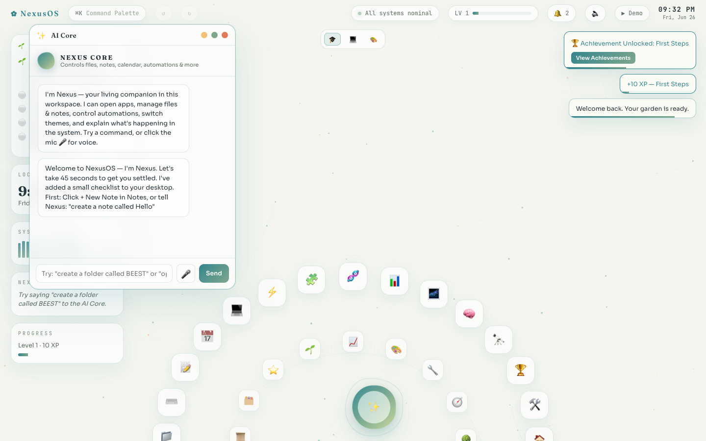
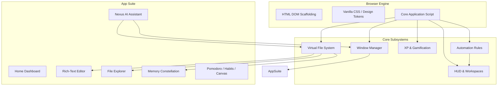
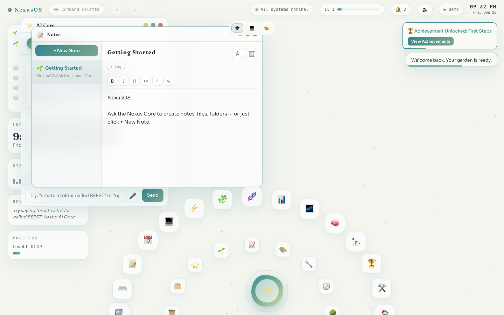
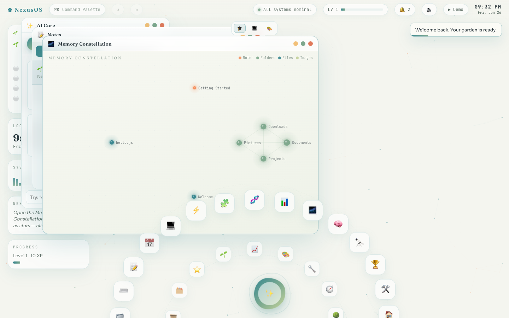
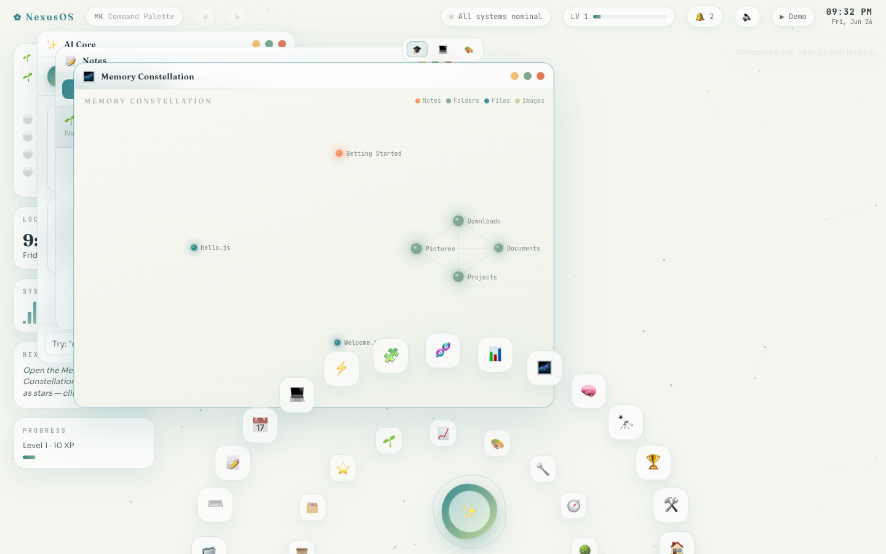

# NexusOS (NovaOS) — Digital Garden

A fully self-contained, single-file browser-based desktop OS simulation featuring an AI assistant, an in-memory virtual file system, rich-text note editing, task calendar, dynamic automation rules, habit tracking, and more—all wrapped in a beautifully styled, nature-inspired, soft botanical "digital garden" design.

---

## Aesthetics & Badges


### Desktop Preview


### Video Walkthrough


---

## Table of Contents

- [Overview](#overview)
- [Quick Start](#quick-start)
- [System Architecture](#system-architecture)
- [Design System & CSS Variables](#design-system--css-variables)
- [Features](#features)
- [Application Suite](#application-suite)
- [Subsystems & Mechanics](#subsystems--mechanics)
- [Theming](#theming)
- [File Structure (Virtual FS)](#file-structure-virtual-fs)
- [Keyboard Shortcuts](#keyboard-shortcuts)
- [Browser Compatibility](#browser-compatibility)
- [Known Limitations](#known-limitations)

---

## Overview

NexusOS (implemented in [NOVA_OS.html](file:///Users/nithinselvaraj/Desktop/Nova%20Os/NOVA_OS.html)) is an entire operating-system-like shell running entirely inside a single HTML file. Designed as a distraction-free, aesthetically pleasing workspace, it requires no server, no installation steps, and no third-party package managers—just open the file in any modern web browser. 

The user interface blends soft organic morphing shapes, premium glassmorphism panels, and a tailored typography setup using three curated typefaces: Fraunces for elegant display titles, Sora for clear body copy, and JetBrains Mono for developer interfaces and terminal logs.

---

## Quick Start

To launch NexusOS immediately, simply open [NOVA_OS.html](file:///Users/nithinselvaraj/Desktop/Nova%20Os/NOVA_OS.html) directly in your browser:

### Using Terminal
```bash
# macOS
open NOVA_OS.html

# Windows
start NOVA_OS.html

# Linux
xdg-open NOVA_OS.html
```

> [!NOTE]
> On your very first boot, NexusOS plays an animated boot sequence featuring a morphing canvas blob, initializes its virtual disk structure, and launches an interactive Demo Tour (7 steps) to guide you through the shell environment.

---

## System Architecture

NexusOS functions as a unified front-end client. Its logic, styling, and template scaffolding reside inside a single web document:



---

## Design System & CSS Variables

The default Garden theme defines the core design system tokens. These properties configure the typography, color spaces, glass effects, and corners:

```css
:root {
  --bg-0: #F4F5EF;
  --bg-1: #EDEFE3;
  --bg-2: #E6EEC9;
  --panel: rgba(255, 255, 255, 0.62);
  --panel-solid: #FBFBF6;
  --accent: #35858E;
  --accent-2: #7DA78C;
  --accent-3: #F58F5C;
  --moss: #C2D099;
  
  --font-display: 'Fraunces', serif;
  --font-body: 'Sora', sans-serif;
  --font-mono: 'JetBrains Mono', monospace;
  
  --radius: 18px;
  --radius-sm: 12px;
}
```

---

## Features

### Desktop Shell
- Interactive Boot Console: Animated canvas morphing logo, load progress bars, and randomized hardware/software checking sequences.
- Top HUD Bar: Displays a persistent clock, custom experience (XP) bar, workspace indicator, quick settings, focus mode toggle, and notification center.
- Workspace Switcher: Pivot instantly between 3 isolated desktops (e.g., School, Coding, Creative). Windows launched on one desktop remain hidden on others.
- Orbital Dock: A circular, spring-loaded application selector. Dragging/hovering reveals smooth animations on radial tracks.
- Predictive Core Launcher: Positioned at the center of the dock. Uses recent application launch frequencies to build a weighted, dynamically sorted app menu.
- Context Menus: Rich right-click desktop menu allowing you to quickly create folders, start new text notes, activate wallpapers, or query the assistant.
- Widget Rail: Left-aligned workspace utility containing a digital clock, activity progress bars, and a rotation of quotes.

### Window Manager (WM)
- Supports dragging, active window resizing, and snap-to-edge indicators.
- Double-clicking titlebars maximizes windows; standard minimize, expand, and close buttons operate on a dynamically sorted Z-index stack.

---

## Application Suite

NexusOS comes preloaded with a suite of custom-engineered applications:

| App ID | Icon | Application Name | Core Description |
|---|---|---|---|
| home | | Dashboard | View session statistics, achievements, daily notes summary, and context-aware action suggestions. |
| notes | | Notebook | Rich-text note editor supporting custom tags, bookmarking, recycle bin recovery, check-lists, and deep undo/redo states. |
| explorer | | Explorer | Visual folder explorer featuring drag-and-drop file organization, custom folders, tagging, and extension filtering. |
| code | | Editor | A simple text and code editor featuring basic formatting and styling optimized for .js, .ts, and .json. |
| calendar | | Calendar | A responsive monthly calendar to track personal reminders, customize event color coding, and log schedules. |
| assistant | | Nexus AI | An AI-assisted interface communicating with Anthropic APIs to perform filesystem modifications or system tasks through natural language. |
| constellation | | Constellation | Interactive HTML5 Canvas mapping all virtual folders and notes as a stellar map. Clicking nodes opens files instantly. |
| timeline | | Timeline | A detailed, chronological log tracking file creations, task completions, and user updates. |
| automations | | Automations | Create trigger-action pairs (e.g., "When Notes Created" to "Show Desktop Notification"). |
| habits | | Habits | Log routine tasks, track check-ins, and build daily habit streaks with progress rings. |
| pomodoro | | Pomodoro | A 25/5-minute focus timer featuring sound alerts and cycle tracking. |
| moodboard | | Moodboard | A visual moodboard canvas. Add interactive stickers, draw notes, and arrange custom cards. |
| widget-creator | | Widget Maker | Develop custom canvas widgets in HTML, CSS, and JS, rendering them live to the desktop background. |
| legacy-tree | | Legacy Tree | A personal growth diagram showing milestones as branching nodes in an organic tree. |
| settings | | Settings | Configure system-wide text scaling, toggle background styles, and swap between primary colors. |
| recycle-bin | | Recycle Bin | Safety archive for deleted files and notes. Items can be restored or purged permanently. |

### Application Views

#### Notebook App


#### Memory Constellation Map


#### Habits and Pomodoro Apps


---

## Subsystems & Mechanics

### Nexus AI Assistant
The AI assistant runs client-side, translating your prompts into operating system commands. It maps intents to trigger internal commands like:
- createNote(title, content)
- createFile(name, content)
- openApp(appId)
- setReminder(date, text)

> [!IMPORTANT]
> To use the assistant, you must insert an Anthropic API Key (claude-sonnet-4-6 model) inside the assistant settings, or run the file in an environment that securely exposes this endpoint.

### Gamification & XP Engine
NexusOS turns daily work into an interactive progression system:
- Experience Points (XP): Earn XP on key events (e.g., Creating Notes +4, Files +3, Folders +2, Automations +5, Habits checked +6).
- Level Ups: Tracking points inside the HUD bar triggers customized level-up sound prompts and notifications.
- Session Summaries: View stats at logoff outlining total active time, created resources, and mood.

---

## Theming

Themes update design tokens dynamically across the document:

| Theme Name | Tone | Aesthetic Profile |
|---|---|---|
| Garden (Default) | Cream & Botanical | Soft olive backgrounds, sage accents, and forest tones. |
| Night | Dark Minimalist | Deep slate background, high contrast white text, bright teal features. |
| Rose | Warm Blush | Pastel pink and peach accents, muted charcoal borders. |
| Ocean | Deep Sea | Navy surfaces, cyan accent highlights, cool gray text. |

---

## File Structure (Virtual FS)

All files created within the virtual environment are kept inside a reactive JavaScript tree structure:

```
/ (Root Virtual Directory)
├── Documents/
│   ├── Journal.txt
│   └── Todo_List.txt
├── Code/
│   └── helper.js
└── CustomFolder/
```

Files and Folders are defined as JSON objects:
```json
{
  "name": "Journal",
  "ext": "txt",
  "content": "Today I built a custom OS...",
  "created": 1719436153000,
  "tags": ["personal", "growth"],
  "favorite": true
}
```

> [!NOTE]
> All states are serialized to JSON and persisted locally inside localStorage under the key nexusOS_state. 

---

## Keyboard Shortcuts

| Shortcut | Command | Action |
|---|---|---|
| <kbd>Ctrl</kbd> + <kbd>K</kbd> / <kbd>Cmd</kbd> + <kbd>K</kbd> | Command Palette | Launches fuzzy-search launcher overlay |
| <kbd>Escape</kbd> | Dismiss / Exit | Closes modals, palette, and exits Focus/Dream Modes |

---

## Browser Compatibility

Requires standard browser features supporting:
- CSS: backdrop-filter, mask-image, Grid layout, Flexbox, custom properties.
- Storage: localStorage API.
- Graphics: HTML5 Canvas (2D context).
- Text Editing: contentEditable and basic execution commands.
- Web APIs: Speech Recognition (optional for voice input).

Compatible with Chrome 120+, Safari 17+, and Firefox 121+.

---

## Known Limitations

- LocalStorage Cap: Since all data is stored inside browser storage, clearing cookies/cache will wipe your folders. Export your data periodically from Settings to prevent loss.
- Single-User Workspace: Designed as a personal, local desktop container.
- AI Requirements: Nexus assistant requires API connectivity to Anthropic endpoints and will error without an internet connection or valid key setup.
- Responsive Layout: The interface is designed primarily for desktop viewports. While responsive, mobile layouts can display minor sizing anomalies.
